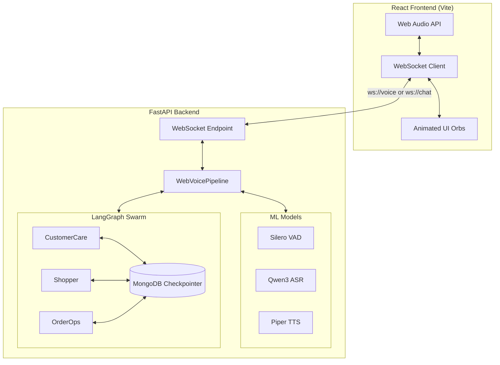
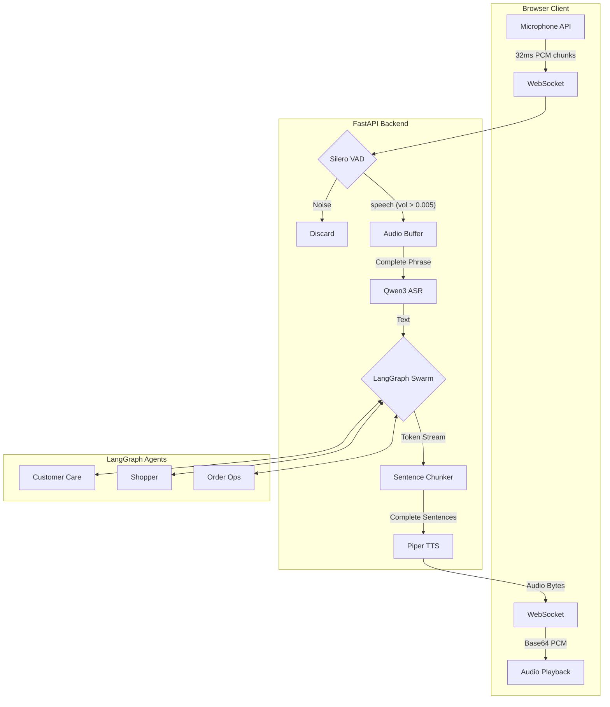

<p align="center">
  
  
  
  
  
  
</p>

# 🎙 OpenVoice AI

> **A real-time, multi-agent voice assistant** powered by LangGraph Swarm architecture. Speak naturally to specialized AI agents — each with their own personality, voice, and expertise — through a stunning animated web interface.

---

## 🌟 Features

| Feature | Description |
|---|---|
| 🗣️ **Real-time Voice** | Speak and listen in real-time via the browser — VAD detects speech, ASR transcribes, LLM responds, TTS speaks back |
| 🤖 **Multi-Agent Swarm** | 3 specialized agents (Customer Care, Shopper, Order Ops) with seamless handoffs via LangGraph |
| 🎨 **Animated Agent Orbs** | Each agent has a unique color identity with animated orb visualizations that glow when speaking |
| 💬 **Dual Mode** | Switch between Voice mode (mic) and Text mode (typing) on the fly |
| 🔄 **Live Agent Handoffs** | Agents transfer conversations to each other based on context — orb morphs colors during handoff |
| 🧠 **Conversation Memory** | MongoDB-backed checkpointer persists conversation state across the session |
| ⚡ **GPU Accelerated** | VAD (Silero), ASR (Qwen3-0.6B), and TTS (Piper) all run on CUDA when available |
| 🎤 **Interrupt Support** | Interrupt the AI mid-sentence — it remembers where it was cut off |

---

## 🏗️ Architecture



---

## 🤖 The Agents

| Agent | Voice | Color | Specialization | Tools |
|---|---|---|---|---|
| **Customer Care** | 🇬🇧 Alba (British) | 🟣 `#6C63FF` | Returns, refunds, policies, general help | `lookup_policy`, transfer tools |
| **Shopper** | 🇺🇸 Bryce (American) | 🟢 `#00C9A7` | Product search, recommendations, catalog | `search_catalog`, transfer tools |
| **Order Ops** | 🇺🇸 HFC Female | 🔴 `#FF6B6B` | Order tracking, delivery status, operations | `check_order_status`, transfer tools |

Each agent can **transfer seamlessly** to another via LangGraph tool calls. The user never notices the handoff — the orb simply morphs its color.

---

## 📂 Project Structure

```
OpenVoice AI/
├── backend/
│   ├── src/
│   │   ├── api/                    # 🌐 FastAPI + WebSocket layer
│   │   │   ├── server.py           # FastAPI app, WS endpoints, REST routes
│   │   │   └── web_pipeline.py     # WebSocket-adapted voice pipeline
│   │   ├── agents/                 # 🤖 LangGraph agent system
│   │   │   ├── session.py          # VoiceSession — LangGraph graph builder
│   │   │   ├── state.py            # VoiceState TypedDict
│   │   │   └── specialized/        # Individual agent definitions
│   │   │       ├── customer_care.py
│   │   │       ├── shopper.py
│   │   │       └── order_ops.py
│   │   ├── asr/                    # 🎤 Automatic Speech Recognition
│   │   │   └── whisper.py          # Qwen3-ASR-0.6B model wrapper
│   │   ├── audio/                  # 🔊 Audio I/O (CLI mode)
│   │   │   └── io.py               # sounddevice mic/speaker (CLI only)
│   │   ├── core/                   # ⚙️ Core abstractions
│   │   │   ├── interfaces.py       # IVAD, IASR, ILLM, ITTS interfaces
│   │   │   └── pipeline.py         # Original CLI voice pipeline
│   │   ├── llm/                    # 🧠 LLM client
│   │   │   └── client.py           # LLMModel — wraps VoiceSession
│   │   ├── tts/                    # 🗣️ Text-to-Speech
│   │   │   └── piper.py            # Piper TTS (ONNX, GPU-accelerated)
│   │   ├── utils/                  # 🛠️ Utilities
│   │   │   └── chunker.py          # SentenceChunker for TTS streaming
│   │   └── vad/                    # 🎯 Voice Activity Detection
│   │       └── silero.py           # Silero VAD (PyTorch, GPU)
│   ├── models/                     # 📦 Downloaded TTS voice models
│   └── .env                        # API keys (not committed)
│
├── frontend/
│   ├── src/
│   │   ├── components/             # ⚛️ React components
│   │   │   ├── VoiceOrb.jsx        # Animated agent orb + particles
│   │   │   ├── AgentLabel.jsx      # Agent name + status badge
│   │   │   ├── MicButton.jsx       # Mic toggle with pulse animation
│   │   │   ├── TranscriptPanel.jsx # Conversation sidebar
│   │   │   ├── TextInputBar.jsx    # Text chat input
│   │   │   ├── ConnectionStatus.jsx# WebSocket status dot
│   │   │   └── ModeToggle.jsx      # Voice ↔ Text switch
│   │   ├── hooks/                  # 🪝 Custom React hooks
│   │   │   ├── useWebSocket.js     # WebSocket connection management
│   │   │   ├── useAudio.js         # Mic capture + TTS playback
│   │   │   └── useVoicePipeline.js # Orchestration hook
│   │   ├── config/
│   │   │   └── agents.js           # Agent metadata constants
│   │   ├── App.jsx                 # Root component
│   │   ├── main.jsx                # React entry point
│   │   └── index.css               # Full design system + animations
│   ├── index.html
│   ├── vite.config.js
│   └── package.json

├── pyproject.toml                  # Python dependencies (uv)
├── uv.lock                         # Locked dependency versions

└── .gitignore
```

---

## 🚀 Getting Started

### Prerequisites

| Tool | Version | Purpose |
|---|---|---|
| **Python** | 3.12.x | Backend runtime |
| **uv** | Latest | Python package manager |
| **Node.js** | 18+ | Frontend tooling |
| **MongoDB** | 4.4+ | Session persistence |
| **CUDA** | 11.8+ | GPU acceleration (optional) |

### 1. Clone the Repository

```bash
git clone https://github.com/BadrinathanTV/OpenVoice-AI.git
cd "OpenVoice AI"
```

### 2. Backend Setup

```bash
cd backend

# Create .env from the example
cp .env.example .env

# Edit .env with your API keys
nano .env
```

**Required `.env` values:**
```env
OPENAI_API_KEY=sk-your-openai-key
GROQ_API_KEY=gsk_your-groq-key
ASR_MODEL_PATH=/path/to/Qwen3-ASR-0.6B
ASR_BACKEND=transformers
ASR_STREAMING_CHUNK_SIZE_SEC=0.64
DATABASE_URL=mongodb://localhost:27017/
```

**Install dependencies and start with `uv` only:**
```bash
# Run this from the repository root
uv sync

# Then start the backend from backend/
cd backend
uv run --project .. uvicorn src.api.server:app --host 0.0.0.0 --port 8000
```

`.python-version` pins the repo to Python `3.12`, so cloud machines and client machines should use that same interpreter line for the most reliable install.

The first run will:
- Download Qwen3-ASR-0.6B model
- Download Piper TTS voice models (~50MB each)
- Install all Python dependencies

To enable Qwen streaming ASR, switch to the vLLM backend:

```env
ASR_BACKEND=vllm
ASR_STREAMING_CHUNK_SIZE_SEC=0.64
```

Install the streaming stack with `uv` before starting the backend:

```bash
uv sync --extra streaming-asr
```

The `streaming-asr` extra is intended for Linux GPU environments, which matches the current CUDA-based deployment path for this project.

### 3. Frontend Setup

```bash
cd frontend

# Install Node.js dependencies
npm install

# Start development server
npm run dev
```

### 4. Open in Browser

Navigate to **http://localhost:5173** — you'll see the animated orb UI.

- Click the **🎤 mic button** to start talking
- Or switch to **💬 Text mode** to type messages
- Watch the orb **glow and pulse** when the AI speaks

---

## 🎨 Frontend Animation States

The agent orb transitions through visual states:

| State | Animation | When |
|---|---|---|
| **Idle** | Gentle breathing pulse | Waiting for user input |
| **Listening** | Concentric ring ripples | Mic active, capturing audio |
| **Processing** | Spinning orbital rings | ASR transcribing speech |
| **Thinking** | Color desaturation + spin | Waiting for LLM response |
| **Speaking** | **Full glow burst** + particles | TTS audio playing back |
| **Handoff** | Color morph crossfade | Agent transferring to another |

---

## 🔌 API Endpoints

### REST

| Method | Path | Description |
|---|---|---|
| `GET` | `/api/health` | Health check, shows if models are loaded |
| `GET` | `/api/agents` | Returns list of available agents with metadata |

### WebSocket

| Path | Mode | Protocol |
|---|---|---|
| `/ws/voice` | Voice mode | Binary (PCM audio) + JSON (status/transcripts) |
| `/ws/chat` | Text mode | JSON only |

**WebSocket message types (server → client):**

```json
{"type": "session", "threadId": "...", "agent": "CustomerCare"}
{"type": "status", "value": "recording|processing|thinking|speaking|idle"}
{"type": "agent", "name": "Shopper"}
{"type": "transcript", "role": "user|ai", "text": "...", "agent": "...", "partial": true|false}
{"type": "audio", "data": "<base64 PCM>", "sampleRate": 22050}
```

---

## 🛠️ Tech Stack

### Backend
| Component | Technology |
|---|---|
| Runtime | Python 3.11+ |
| Web Server | FastAPI + Uvicorn |
| Agent Framework | LangGraph Swarm |
| LLM | OpenAI GPT-4o-mini |
| ASR | Qwen3-ASR-0.6B (GPU) |
| TTS | Piper TTS (ONNX, GPU) |
| VAD | Silero VAD (PyTorch, GPU) |
| Database | MongoDB (checkpoint persistence) |
| Package Manager | uv |

### Frontend
| Component | Technology |
|---|---|
| Framework | React 19 + Vite |
| Styling | Vanilla CSS (design tokens) |
| Audio | Web Audio API |
| Communication | WebSocket (native) |
| Font | Inter (Google Fonts) |

---

## 🧱 SOLID Principles

The codebase follows SOLID design principles:

- **Single Responsibility** — Each component, hook, and module has one job (e.g., `VoiceOrb` only renders, `useAudio` only handles audio)
- **Open/Closed** — Agent config in `agents.js` is extendable without modifying components. Add a new agent by adding an entry.
- **Liskov Substitution** — All backend modules implement abstract interfaces (`IVAD`, `IASR`, `ILLM`, `ITTS`). Swap implementations freely.
- **Interface Segregation** — `useVoicePipeline` exposes a clean API without leaking WebSocket or Audio internals to components.
- **Dependency Inversion** — React components receive data via props from hooks, not from globals. Backend pipeline depends on interfaces, not concrete classes.

---

## 📄 Voice Pipeline Flow



---

## 🔧 Configuration

### Environment Variables

| Variable | Required | Default | Description |
|---|---|---|---|
| `OPENAI_API_KEY` | ✅ | — | OpenAI API key for GPT-4o-mini |
| `GROQ_API_KEY` | ❌ | — | Groq API key (alternative LLM provider) |
| `ASR_MODEL_PATH` | ❌ | `Qwen3-ASR-0.6B` | Path to local ASR model |
| `ASR_BACKEND` | ❌ | `transformers` | ASR backend: `transformers` or `vllm` |
| `ASR_STREAMING_CHUNK_SIZE_SEC` | ❌ | `0.64` | Streaming ASR decode chunk size in seconds |
| `ASR_ALLOW_BACKEND_FALLBACK` | ❌ | `true` | Fall back to transformers if vLLM ASR fails to initialize |
| `DATABASE_URL` | ❌ | `mongodb://localhost:27017/` | MongoDB connection URL |

### Adding a New Agent

1. Create `backend/src/agents/specialized/your_agent.py` with a system prompt, tools, and `get_your_agent()` function
2. Register it in `backend/src/agents/session.py` (add node + routing)
3. Add TTS voice in `backend/src/api/web_pipeline.py`
4. Add agent metadata in `frontend/src/config/agents.js`

---

## 📜 License

This project is for educational and research purposes.

---

<p align="center">
  Built with ❤️ by <strong>The Three !</strong>
</p>

